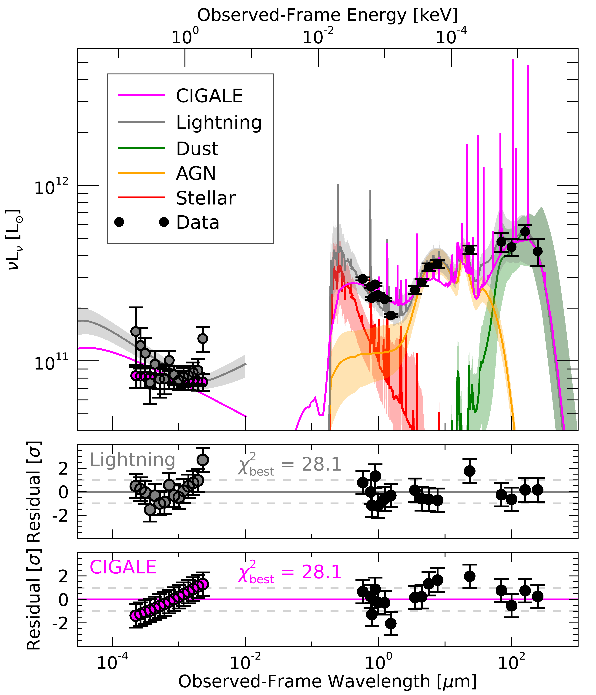

X-ray AGN SED Fitting Code Comparison
=====================================

The following example shows how the X-ray and UV-to-IR AGN models in Lightning compare
with those in `CIGALE <https://cigale.lam.fr>`_ by fitting the X-ray to IR SED of a
bright AGN, J033226.49-274035.5.
 

Data
^^^^

For the UV-to-IR photometry, we utilize the same data for J033226.49-274035.5 described
in the example on :ref:`xray-agn-example-label`. However, CIGALE requires absorption corrected
X-ray fluxes rather than the net X-ray counts used in the :ref:`xray-agn-example-label`
example. 

This conversion to absorption-corrected fluxes requires us to either assume or fit a spectral
model to the X-ray spectrum prior to performing the full SED fit, in order to include the
X-ray data. For CIGALE's data, we have fit the X-ray spectrum with an absorbed power-law
using `Sherpa <https://cxc.cfa.harvard.edu/sherpa/>`_, finding a best-fit :math:`\Gamma = 1.96` and
:math:`{\rm N_H} < 1 × 10^{20} {\rm cm}^{−2}`. From this X-ray spectrum fit, we then calculated
the absorption-corrected fluxes for input into CIGALE in 15 log-spaced bands from 0.5–6.0 keV.

The relevant data file for the CIGALE fit can be found in 
``examples/AGN_J033226/cigale/`` as ``cigale_input.txt``.

Running CIGALE
^^^^^^^^^^^^^^

Since, we have already run Lightning on this data and discussed the results in the example on
:ref:`xray-agn-example-label`, we just need to run CIGALE. We have included the CIGALE configuration
file that we used in ``examples/AGN_J033226/cigale/`` as ``pcigale.ini``. Additionally, since
our data includes filters not in the current version of CIGALE, we have created a bash
file (``cigale_fit.bash``) in ``examples/AGN_J033226/cigale/`` that can easily be run to
add the needed filters and run CIGALE.

Since CIGALE is in Python and requires its own installation, we also include all of the saved outputs
from our run of the bash script in ``examples/AGN_J033226/cigale/out/``. 

.. note::

    To run the bash script, you will need to install CIGALE as
    instructed in their documentation (`CIGALE Installation 
    <https://cigale.lam.fr/documentation/>`_)
    Once it is installed, you can run this script by changing to the
    Lightning examples directory for the CIGALE example of J033226 (``examples/AGN_J033226/cigale/``).

With the configuration we’ve selected for CIGALE, it may take around 7-9 hours on a simple laptop
CPU (we ran it on a ca. 2016 1.2 GHz Intel Core m5).

Analysis
^^^^^^^^

Once the CIGALE fit finishes, let's load it and the results for Lightning from
the example on :ref:`xray-agn-example-label`.

.. code-block:: idl

    cd, !lightning_dir + 'examples/AGN_J033226/'
    cigale_sed = mrdfits('cigale/out/J033226_best_model.fits', 1,hd)
    cigale_obs = mrdfits('cigale/out/observations.fits', 1)
    cigale_results = mrdfits('cigale/out/results.fits', 1)
    lghtng = mrdfits('xray/lightning_output/J033226_xray_output.fits.gz', 1)

Figures
"""""""

Now that we have loaded the files, we will make some figures to see how the results from the
different codes compare. First, we will plot the high resolution model spectra and residuals to
see if the two codes fit the data well. We have prepared a function for this: ``compare_cigale_seds.pro``.

.. code-block:: idl

    fig = compare_cigale_seds(lghtng, cigale_sed, cigale_obs, cigale_results)

From the plot, we can see that each of the :math:`\chi^2` values and residuals for both codes
appropriately model the data. With the uncertainty range on the Lightning models, it can be seen that the best-fit model
SED for both codes are highly consistent in the UV-to-IR, but differ in the X-rays. This difference in the
X-ray is mainly caused by the difference in models (Lightning uses the more flexible ``qsosed`` model,
while CIGALE uses a more rigid power-law) and input data (Lightning uses the observed counts,
while CIGALE uses absorption-corrected fluxes).

Finally, let's compare some derived physical properties from each SED fitting code. Specifically, let's look
at AGN properties such as the AGN torus inclination (:math:`i_{\rm AGN}`), the UV-to-IR AGN bolometric
luminosity (:math:`L_{\rm AGN}`), the fraction of AGN IR luminosity to the total IR luminosity from 5–1000
:math:`\mu{\rm m}` (:math:`{\rm frac_{\rm AGN}}`), and the slope of the 2 keV to 2500 Angstrom relationship
(:math:`\alpha_{\rm OX}`). We have prepared a procedure to calculate all of these properties and print them
to our terminal for us: ``compare_cigale_properties.pro``.

.. code-block:: idl

    compare_cigale_properties, lghtng, cigale_results

.. code-block:: text

    //Inclination Comparison//
    Lightning iAGN: 40.6 (+0.7 / -7.0)
    CIGALE iAGN:    33.1 (+/- 10.7)
    
    //log10(LAGN) Comparison//
    Lightning LAGN: 12.10 (+0.03 / -0.04)
    CIGALE LAGN:    12.26 (+/- 0.07)
    
    //fracAGN Comparison//
    Lightning fracAGN: 0.45 (+0.03 / -0.03)
    CIGALE fracAGN:    0.47 (+/- 0.13)
    
    //alpha_OX Comparison//
    Lightning alpha_OX: -1.29 (+0.02 / -0.02)
    CIGALE alpha_OX:    -1.32 (+/- 0.04)

We can see from the output that both codes have derived parameters that are in excellent agreement, except :math:`L_{\rm AGN}`.
While :math:`L_{\rm AGN}` is not in :math:`1\sigma` agreement, this is likely due to the strong constraint placed on
this parameter by the 15 bands of X-ray data. However, all other parameters agree perfectly, indicating that both
Lightning and CIGALE are producing similar results, while having different models and implementations.