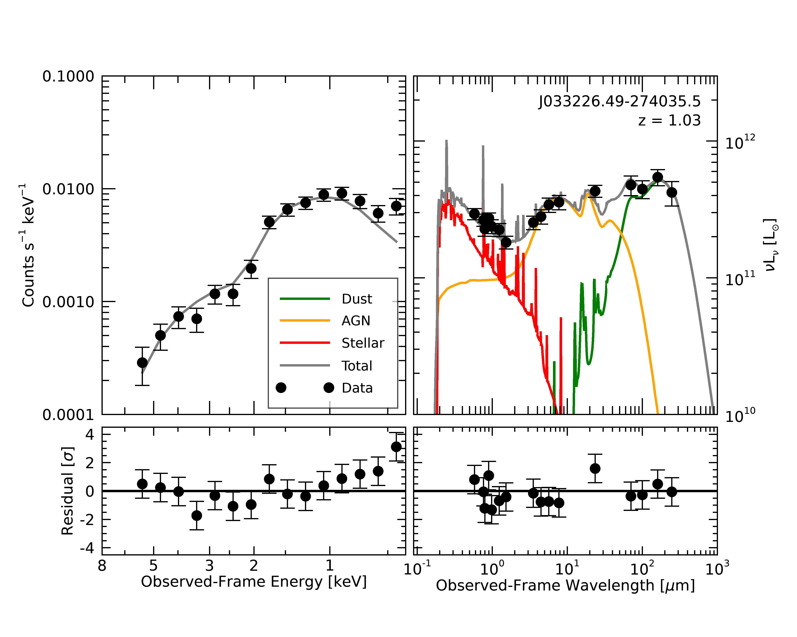
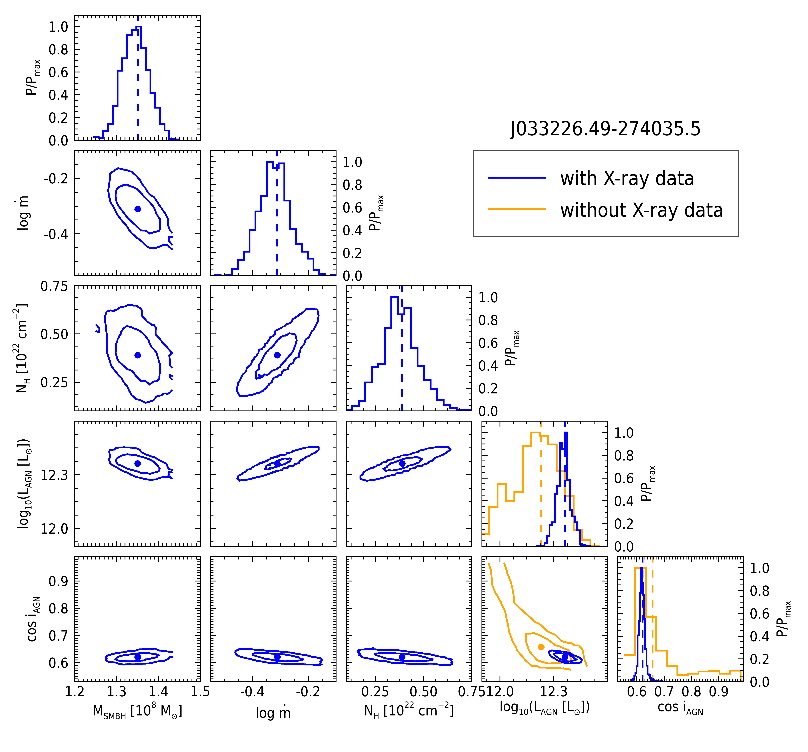

.. _xray-agn-example-label:

X-ray AGN Emission of J033226
=============================

The following example shows how we can use Lightning to fit the
X-ray to IR SED of a bright AGN, J033226.49-274035.5, in the Chandra Deep Field South.

Data
^^^^

Typically it will only be necessary to fit with 2-4 band X-ray photometry (or even one band, e.g. if we
assume negligible intrinsic absorption). Here, to show what's possible in principle with the Lightning X-ray
implementation, we're going to fit 15-band X-ray photometry. To do so, we downloaded the level 3 spectral file
and response from the Chandra Source Catalog for the single deepest (:math:`\approx` 163 ks) observation of
the source (ObsID 5019). We then subtracted the background and grouped the net counts from the spectrum into
15 log-spaced bins from :math:`0.5-6.0~\rm keV` using ``Sherpa``. [#f2]_ We calculated the uncertainty
:math:`\sigma N` on the net counts :math:`N` as

.. math:: \sigma N^2 = \sigma S^2 + {\tt BKG\_SCALE}^2 \sigma B^2

where

.. math:: \sigma S = 1 + \sqrt{3/4 + S}

and

.. math:: \sigma B = 1 + \sqrt{3/4 + B}

for source and background counts :math:`S` and :math:`B`, and :math:`{\tt BKG\_SCALE}` is the background exposure
scale. [#f3]_

We retrieved optical-IR photometry from the `Guo et al. (2013)`_ CANDELS photometric catalogs, including IR photometry
from the `Barro et al. (2019)`_ catalogs. We added calibration uncertainties (typically :math:`<5\%`) to
each band as specified in Table 1 of `Doore et al. (2022)`_.

The relevant data files can be found in ``examples/AGN_J033226/`` as ``xray/J033226_photometry.fits``,
``xray/J033226_xray_photometry.fits``, ``xray/J033226_summed.arf`` for the UV-to-IR photometry, X-ray data,
and ARF, respectively.

Configuration
^^^^^^^^^^^^^

For this example we'll configure Lightning to use the SKIRTOR :ref:`agn-emission-model` templates
and fit both with and without an AGN :ref:`xray-emission-model` model to see how adding X-ray data
to the fits affects the results.

Common Settings
"""""""""""""""
For both runs, we change the below lines of the configuration files in ``examples/AGN_J033226/noxray/``
and ``examples/AGN_J033226/xray/`` from the defaults.

First we change the output filename:

.. literalinclude:: ../../../examples/AGN_J033226/noxray/lightning_configure.pro
    :language: idl
    :dedent:
    :lines: 71
    :lineno-match:
    :emphasize-lines: 1

We add :math:`10\%` model uncertainty:

.. It is actually possible to include files from above the
.. top level directory of the documentation source.
.. literalinclude:: ../../../examples/AGN_J033226/noxray/lightning_configure.pro
    :language: idl
    :dedent:
    :lines: 91
    :lineno-match:
    :emphasize-lines: 1

The default initializations on the SFH are then widened, as we expect this :math:`z \sim 1` AGN host
to have a large SFR:

.. literalinclude:: ../../../examples/AGN_J033226/noxray/lightning_configure.pro
    :language: idl
    :dedent:
    :lines: 189-194
    :lineno-match:
    :emphasize-lines: 4-5

We then limit the mass abundance of PAHs in the dust model

.. literalinclude:: ../../../examples/AGN_J033226/noxray/lightning_configure.pro
    :language: idl
    :dedent:
    :lines: 385-388
    :lineno-match:
    :emphasize-lines: 1-2

And turn on the UV-IR AGN model:

.. literalinclude:: ../../../examples/AGN_J033226/noxray/lightning_configure.pro
    :language: idl
    :dedent:
    :lines: 486
    :lineno-match:
    :emphasize-lines: 1

Since J033226 is classified as a type 1 AGN from optical spectra, we limit the inclination
of the models to type 1 AGN accordingly:

.. literalinclude:: ../../../examples/AGN_J033226/noxray/lightning_configure.pro
    :language: idl
    :dedent:
    :lines: 516-519
    :lineno-match:
    :emphasize-lines: 2-3

We also set the prior on the AGN normalization to log-uniform on :math:`10^{11}-10^{13}\ \rm L_{\odot}` and
initialize in a narrow range of luminosities, as initializing the AGN component far from the
solution has a negative effect on convergence.

.. literalinclude:: ../../../examples/AGN_J033226/noxray/lightning_configure.pro
    :language: idl
    :dedent:
    :lines: 496-499
    :emphasize-lines: 2-3

Finally, we increase the number of MCMC trials per walker to :math:`4 \times 10^4`:

.. literalinclude:: ../../../examples/AGN_J033226/noxray/lightning_configure.pro
    :language: idl
    :dedent:
    :lines: 539
    :lineno-match:
    :emphasize-lines: 1

and change the proposal width parameter to :math:`a = 1.8` to increase the MCMC acceptance rate:

.. literalinclude:: ../../../examples/AGN_J033226/noxray/lightning_configure.pro
    :language: idl
    :dedent:
    :lines: 572
    :lineno-match:
    :emphasize-lines: 1

X-ray Fit
"""""""""

For the fit with the X-ray model, we additionally modify the following settings in
``examples/AGN_J033226/xray/lightning_configure.pro``.
We turn on the X-ray emission module,

.. literalinclude:: ../../../examples/AGN_J033226/xray/lightning_configure.pro
    :language: idl
    :dedent:
    :lines: 415
    :lineno-match:
    :emphasize-lines: 1

set the module to use the errors we calculated on the net counts,

.. literalinclude:: ../../../examples/AGN_J033226/xray/lightning_configure.pro
    :language: idl
    :dedent:
    :lines: 427
    :lineno-match:
    :emphasize-lines: 1

modify the default initialization range for the column density,

.. literalinclude:: ../../../examples/AGN_J033226/xray/lightning_configure.pro
    :language: idl
    :dedent:
    :lines: 439-442
    :lineno-match:
    :emphasize-lines: 3

and narrow the initialization range for the SMBH mass:

.. literalinclude:: ../../../examples/AGN_J033226/xray/lightning_configure.pro
    :language: idl
    :dedent:
    :lines: 459-462
    :lineno-match:
    :emphasize-lines: 3

Finally, we generate high resolution models for all final MCMC chain elements so
that we can use them to calculate other properties later.

.. literalinclude:: ../../../examples/AGN_J033226/xray/lightning_configure.pro
    :language: idl
    :dedent:
    :lines: 654
    :lineno-match:
    :emphasize-lines: 1

Running Lightning
^^^^^^^^^^^^^^^^^
.. note::

	The IDL code snippets below are also available in batch file format, as ``examples/AGN_J033226/J033226_batch.pro``.

At this point, we are ready to run Lightning with each configuration. We can do this with:

.. literalinclude:: ../../../examples/AGN_J033226/J033226_batch.pro
    :language: idl
    :lines: 7-10

With the MCMC configuration we've selected for the fit with no X-ray model (since we're aiming for a comprehensive sampling of the posterior),
this may take around 40-50 minutes on a moderately powerful laptop CPU (we ran it on a ca. 2015 2.9 GHz Intel Core i5).
For the fit with the X-ray data, this will take about an hour, due to the added complexity of the X-ray model and the additional
photometry. We note that the fits could also be run simultaneously in separate IDL sessions.

Analysis
^^^^^^^^

Once the fits finish, Lightning will automatically create post-processed files for us containing the models and
the sampled posterior distributions.

.. literalinclude:: ../../../examples/AGN_J033226/J033226_batch.pro
    :language: idl
    :lines: 13-14

Convergence
"""""""""""

With the results loaded, our first step should be to check on the status of our fits:

.. literalinclude:: ../../../examples/AGN_J033226/J033226_batch.pro
    :language: idl
    :lines: 17-21

which outputs

.. code-block:: text

    //Convergence for the fit without the X-ray model//
    Mean acceptance fraction: 0.25888400
    Convergence flag: 0
    Short chain flag: 0
    Number of "stranded" walkers: 2.00000

It seems that we have a reasonable acceptance fraction (i.e., :math:`>20 \%`), and that we can be confident
in the solution and the number of samples in the posterior, since the convergence flag is 0. We see however
that 2/75 of the walkers in the ensemble didn't reach the same solution as the others; this tends to happen
when they're initialized too close to the boundary set by the priors. We could adjust the settings and retry,
but we have enough samples in the posterior as-is, so we'll leave it.

Now we check the X-ray fit:

.. literalinclude:: ../../../examples/AGN_J033226/J033226_batch.pro
    :language: idl
    :lines: 25-29

.. code-block:: text

    //Convergence for the fit with the X-ray model//
    Mean acceptance fraction: 0.22930733
    Convergence flag: 1
    Short chain flag: 0
    Number of "stranded" walkers: 2.00000

We can see that Lightning is concerned about whether the MCMC chains converged. If we do

.. literalinclude:: ../../../examples/AGN_J033226/J033226_batch.pro
    :language: idl
    :lines: 31-32

we see

.. code-block:: text

    Number of walkers with low acceptance fractions: 0.00000
    Number of parameters with high autocorrelation times: 3.00000

The convergence flag is set because a three parameters had high autocorrelation times.
Let's check what parameter this is and how it compares to our factor of 50 threshold for
considering convergence (i.e., ``NTRIALS/AUTOCORR_TIME`` should be ~50). 

.. literalinclude:: ../../../examples/AGN_J033226/J033226_batch.pro
    :language: idl
    :dedent:
    :lines: 36-40

.. code-block:: text

    //Autocorrelation Time Checks//
    Parameter with high autocorrelation time:  TAUV AGN_LOGMDOT AGN_COSI
    Ratio of Ntrials to autocorr_time:  44.566111 47.838389 38.319755

So as we can see, the "problem" parameters are the optical depth, accretion rate, and AGN inclination.
Additionally, we can see that the optical depth and accretion rate are just barely below our default 
threshold of 50, while the inclination is well below. Since we want a value of ~50, this is close enough
for the optical depth and accretion rate. However, for the inclination, this is likely due to
the strong prior we introduced, which is limiting the model to an inclination range it does not prefer.
Therefore, we will still use this solution and note that our inclination estimates may not be the
most independently sampled.

Figures
"""""""

Now, we want to look at the SED fit. We'll plot the UV-IR SED component in the "traditional" way,
but since we've got so much X-ray photometry we'll plot the X-ray component in the way you might expect
from ``XSpec`` or ``Sherpa``, just for fun. We have prepared a function for this: ``J033226_spectrum_plots.pro``.

.. literalinclude:: ../../../examples/AGN_J033226/J033226_batch.pro
    :language: idl
    :lines: 46

The plot of the best-fitting models looks like so:

We can see that the joint X-ray-IR fit works quite well in this case. Remember that though we've plotted the
X-ray and optical-IR components on separate axes, they are fit jointly: the likelihood in the MCMC is the
combined likelihood of both components.

Now, let's compare the posteriors. However, since the two fits have different parameters, we'll do some additional
postprocessing to generate the posterior on the UV-IR AGN luminosity for the fit with the X-ray model. The
script ``calc_integrated_AGN_luminosity.pro`` in the ``lightning/examples/AGN_J033226/`` directory
generates this posterior.

.. literalinclude:: ../../../examples/AGN_J033226/J033226_batch.pro
    :language: idl
    :lines: 55-60

which shows the following:

.. code-block:: text

    ** Structure <62b85a08>, 9 tags, length=56024, data length=56024, refs=1:
    SED_ID          STRING    'J033226.49-274035.5'
    REDSHIFT        DOUBLE           1.0310000
    NH              DOUBLE    Array[1000]
    AGN_MASS        DOUBLE    Array[1000]
    AGN_LOGMDOT     DOUBLE    Array[1000]
    TAU97           DOUBLE    Array[1000]
    AGN_COSI        DOUBLE    Array[1000]
    L2500           DOUBLE    Array[1000]
    LBOL_AGN_MODEL  DOUBLE    Array[1000]

The ``agn_model_lum.LBOL_AGN_MODEL`` is the posterior on the integrated optical-IR luminosity for the X-ray fit.
With this in hand we can compare the posterior distributions of the AGN model parameters. Again, we have a plotting
function for this, in ``posterior_comparison.pro``:

.. literalinclude:: ../../../examples/AGN_J033226/J033226_batch.pro
    :language: idl
    :lines: 65

Which generates the following plot:

.. rubric:: Footnotes

.. [#f1] https://cxc.cfa.harvard.edu/ciao/
.. [#f2] https://cxc.cfa.harvard.edu/sherpa/
.. [#f3] For bright sources in deep fields (such as this one), one may also wish to add another term to the X-ray uncertainties to match the X-ray SNR to the UV-IR observations and avoid overfitting the X-ray data. However, for this simple example we use only the uncertainties quoted above.

.. References
.. _Guo et al. (2013): https://ui.adsabs.harvard.edu/abs/2013ApJS..207...24G/abstract
.. _Barro et al. (2019): https://ui.adsabs.harvard.edu/abs/2019ApJS..243...22B/abstract
.. _Doore et al. (2022): https://ui.adsabs.harvard.edu/abs/2022ApJ...931...53D/abstract
