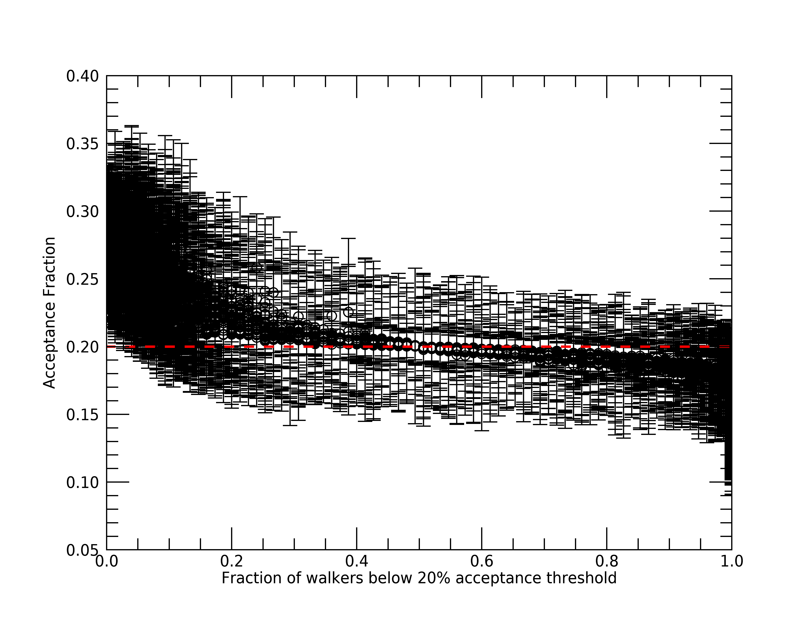
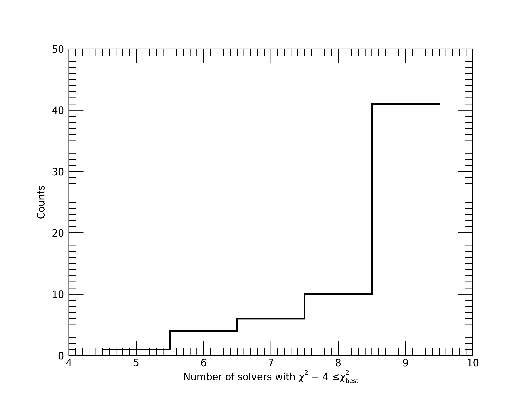
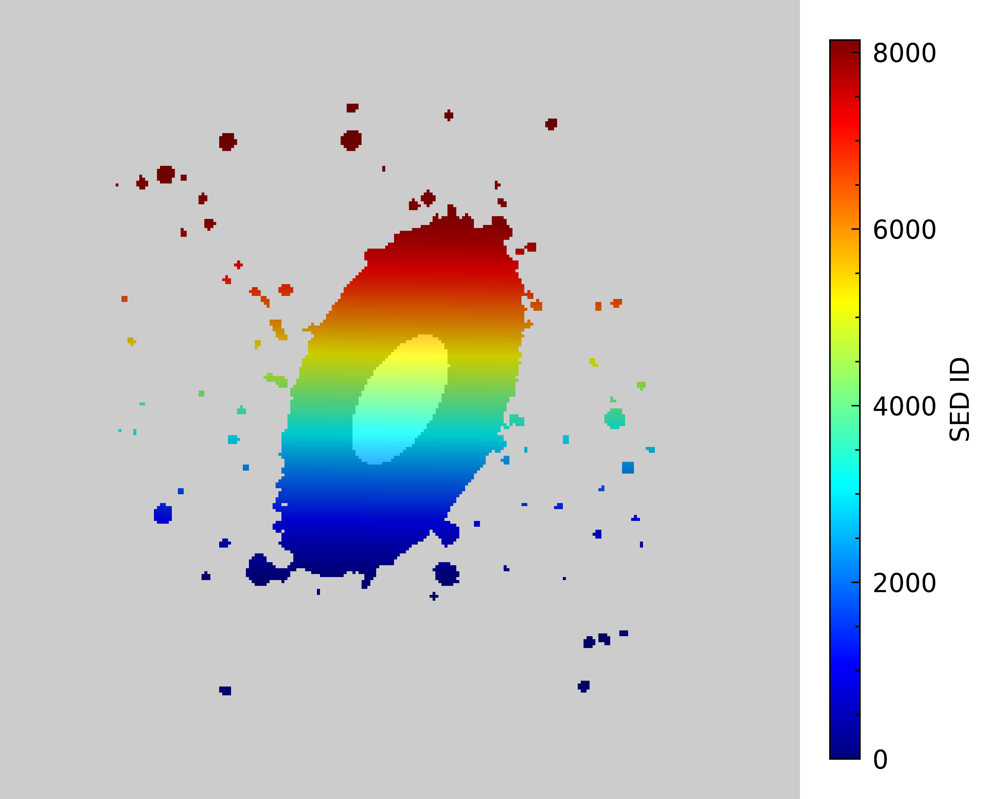
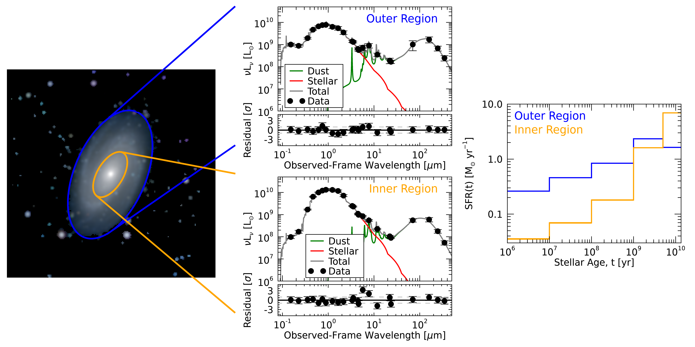
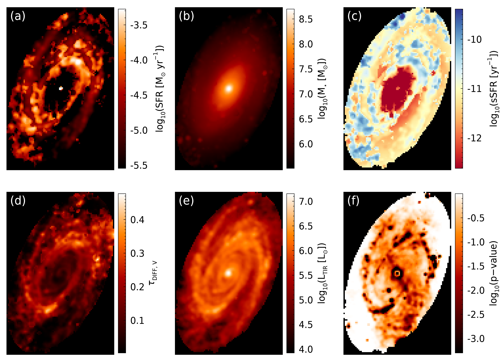

Spatially Resolved Map of M81
=============================

The following example shows how we can use Lightning to fit spatially resolved
UV-to-FIR photometry (SED map) of the nearby spiral galaxy, M81.
 

Data
^^^^

We compiled the UV-to-FIR photometry (GALEX, SDSS, 2MASS, WISE, IRAC, MIPS CH1, PACS blue and red, and SPIRE 250 and 350
:math:`\mu{\rm m}`)
from publicly available images, using the image processing techniques outlined in Section 2 of `Eufrasio et al. (2017) 
<https://ui.adsabs.harvard.edu/abs/2017ApJ...851...10E/abstract>`_. These steps consisted of:

1) subtracting foreground stars,
2) convolving each image to a common :math:`25^{\prime\prime}` PSF,
3) re-binning them to a common :math:`10^{\prime\prime}` pixel scale,
4) estimating the background to update the photometric uncertainties,
5) correcting each bandpass for Galactic extinction,
6) combining the images into a data cube which contains the pixel-by-pixel SEDs.

We further structured the SED map data cube to have the :ref:`fits-format-label` for input into Lightning.
This input data file can be found in ``examples/map_M81/`` as ``m81_data.fits``, where
the primary image extension is the key linking each ``SED_ID`` in the first extension data table
to the corresponding pixel, and the table in the first extension is the Lightning formated input data.

.. warning::

    Due to the large number of model evaluations required to fit this map with the MCMC sampler (:math:`5.229 \times 10^9`)
    and the MPFIT minimizer (:math:`\approx 7.8 \times 10^7`), we fit this example on a 32-core node of the Pinnacle cluster at the
    Arkansas High Performance Computing Center. The number of SED fits involved mean that storage requirements
    are also significant: >90 GB for the MCMC method and >10 GB for MPFIT. As such, we recommend downloading the post-processed
    results for each method `here <https://zenodo.org/record/7661361#.Y_T94C-B3UI>`_ (or by using the
    download shell script: ``examples/map_M81/m81_postprocess_download.sh``) to follow along with the example,
    rather than fitting the data yourself.

Configuration
^^^^^^^^^^^^^

For this example, we'll configure Lightning to use :ref:`stellar-emission-model`, the modified
Calzetti :ref:`dust-attenuation-model`, and :ref:`dust-emission-model` models. Since we fit
with both the :ref:`affine-mcmc-label` and :ref:`mpfit-algorithm-label` algorithms, we first 
change the below lines of the configuration files in ``examples/map_M81/MCMC/`` and
``examples/map_M81/MPFIT/`` from the defaults to the configuration settings in common
between the two algorithms.

Common Settings
"""""""""""""""

When we run this example, we use a 32 core CPU.

.. literalinclude:: ../../../examples/map_M81/MCMC/lightning_configure.pro
    :language: idl
    :dedent:
    :lineno-match:
    :lines: 81
    :emphasize-lines: 1

We add 5% model uncertainty

.. literalinclude:: ../../../examples/map_M81/MCMC/lightning_configure.pro
    :language: idl
    :dedent:
    :lineno-match:
    :lines: 91
    :emphasize-lines: 1

and shrink the default initializations on the SFH, as we expect each pixel to have a small SFR.

.. literalinclude:: ../../../examples/map_M81/MCMC/lightning_configure.pro
    :language: idl
    :dedent:
    :lineno-match:
    :lines: 189-194
    :emphasize-lines: 4-5

We use the more complex modified Calzetti attenuation curve, since we have high-quality optical and IR
data which may require a more flexible attenuation curve. We only change the initializations on 
:math:`\tau_{{\rm DIFF}, V}` to smaller values, since each pixel on average should have low attenuation.

.. literalinclude:: ../../../examples/map_M81/MCMC/lightning_configure.pro
    :language: idl
    :dedent:
    :lineno-match:
    :lines: 211
    :emphasize-lines: 1

.. literalinclude:: ../../../examples/map_M81/MCMC/lightning_configure.pro
    :language: idl
    :dedent:
    :lineno-match:
    :lines: 232-235
    :emphasize-lines: 3

As for the dust emission model, we limit initialization of :math:`U_{\rm min}` and :math:`\gamma` to
lower values than the default, since nearby galaxies like M81 typically have :math:`U_{\rm min} < 5`
and :math:`\gamma \approx 0.01` (`Dale et al. 2017 <https://ui.adsabs.harvard.edu/abs/2017ApJ...837...90D/abstract>`_).

.. literalinclude:: ../../../examples/map_M81/MCMC/lightning_configure.pro
    :language: idl
    :dedent:
    :lineno-match:
    :lines: 341-344
    :emphasize-lines: 3

.. literalinclude:: ../../../examples/map_M81/MCMC/lightning_configure.pro
    :language: idl
    :dedent:
    :lineno-match:
    :lines: 374-377
    :emphasize-lines: 3

MCMC
""""

For the MCMC algorithm configuration only (i.e., ``examples/map_M81/MCMC/lightning_configure.pro``),
we set the output file name to:

.. literalinclude:: ../../../examples/map_M81/MCMC/lightning_configure.pro
    :language: idl
    :dedent:
    :lineno-match:
    :lines: 71
    :emphasize-lines: 1

We then decrease the number of MCMC trials per walker to :math:`10^4`:

.. literalinclude:: ../../../examples/map_M81/MCMC/lightning_configure.pro
    :language: idl
    :dedent:
    :lineno-match:
    :lines: 539
    :emphasize-lines: 1

Next, we adjust the MCMC post-processing settings to pre-defined values for the burn-in, thinning, and number
of final chain elements. 

.. literalinclude:: ../../../examples/map_M81/MCMC/lightning_configure.pro
    :language: idl
    :dedent:
    :lineno-match:
    :lines: 628
    :emphasize-lines: 1

.. literalinclude:: ../../../examples/map_M81/MCMC/lightning_configure.pro
    :language: idl
    :dedent:
    :lineno-match:
    :lines: 638
    :emphasize-lines: 1

.. literalinclude:: ../../../examples/map_M81/MCMC/lightning_configure.pro
    :language: idl
    :dedent:
    :lineno-match:
    :lines: 643
    :emphasize-lines: 1

Finally, we reduce the definition of a stranded walker to one standard deviation below the median
acceptance fraction. We found this reduction is necessary to ensure all pixels have any stranded
walkers correctly classified, since an individual pixel SED is not as well behaved as a galaxy
integrated SED, which we base our default value.

.. literalinclude:: ../../../examples/map_M81/MCMC/lightning_configure.pro
    :language: idl
    :dedent:
    :lineno-match:
    :lines: 660
    :emphasize-lines: 1

MPFIT
"""""

For the MPFIT algorithm configuration only (i.e., ``examples/map_M81/MPFIT/lightning_configure.pro``),
we set the output file name to:

.. literalinclude:: ../../../examples/map_M81/MPFIT/lightning_configure.pro
    :language: idl
    :dedent:
    :lineno-match:
    :lines: 71
    :emphasize-lines: 1

We then select to use the MPFIT algorithm by updating the fitting method:

.. literalinclude:: ../../../examples/map_M81/MPFIT/lightning_configure.pro
    :language: idl
    :dedent:
    :lineno-match:
    :lines: 533
    :emphasize-lines: 1

Finally, we slightly reduce the number of solvers to increase fitting speed.

.. literalinclude:: ../../../examples/map_M81/MPFIT/lightning_configure.pro
    :language: idl
    :dedent:
    :lineno-match:
    :lines: 579
    :emphasize-lines: 1

Running Lightning
^^^^^^^^^^^^^^^^^

.. note::

    The IDL code snippets below are also available in batch file format, as 
    ``examples/map_M81/m81_batch.pro``. The two lines explicitly for
    fitting, as given below, are in the file but are commented out, since fitting
    can take an extended period of time.

Now that we have set up the configurations, we are ready to run Lightning. However, since we only want to
fit a subset of the SEDs found in ``m81_data.fits``, let's select the subset and save the data in
a new file. First, we generate the B-band ellipse region that will define our subset of SEDs, with the
ellipse shape parameters coming from the `HyperLeda database <http://leda.univ-lyon1.fr/>`_.

.. literalinclude:: ../../../examples/map_M81/m81_batch.pro
    :language: idl
    :dedent:
    :lines: 2-21

Let's make images of the ``SED_ID`` image (``m81_map``) and B-band mask to make sure this worked as
we expect. We will set the ``SED_ID`` image to have its pixels color coded based on the ``SED_ID``, where
any blank white area indicates pixels with no associated data, due to low SNR. As for the B-band mask,
we will set pixels within the ellipse to be white and those outside to be black to help show the extent
of the full image. We will then overplot it on the ``SED_ID`` map with some transparency to see how they align.

.. literalinclude:: ../../../examples/map_M81/m81_batch.pro
    :language: idl
    :dedent:
    :lines: 26-39

.. _B-band-mask-label:

.. figure:: ../../../examples/map_M81/images/img_bband_mask.png
    :alt: image of the B-band mask over the SED ID map

Great, our mask looks like it is covering the extent we expect. Now, we are
ready to select the subset of SEDs that fall within this ellipse region.

.. literalinclude:: ../../../examples/map_M81/m81_batch.pro
    :language: idl
    :dedent:
    :lines: 44-57

Now that we have created files containing the subset of SEDs that we want to fit, we can fit them with:

.. code-block:: idl

    restore, !lightning_dir + 'lightning.sav'
    lightning, 'MCMC/m81_input.fits'

For the MPFIT fitting, this is done with:

.. code-block:: idl

    lightning, 'MPFIT/m81_input.fits'

.. note::

    If you downloaded our post-processed files as recommended rather than fitting, you will need to create
    and place those files in the respective ``lightning_output`` directory. To simplify this for you,
    you can use the following IDL commands to create the directories and move the downloaded files.
    If you used the shell script to download the files, this steps was done for you and can be ignored.

    .. code-block:: idl
    
        file_mkdir, ['MCMC', 'MPFIT'] + '/lightning_output'
        file_move, '<downloaded_file_path>/m81_map_mcmc.fits.gz', 'MCMC/lightning_output/'
        file_move, '<downloaded_file_path>/m81_map_mpfit.fits.gz', 'MPFIT/lightning_output/'

Analysis
^^^^^^^^

Convergence
"""""""""""

Once the fits finish, Lightning will automatically create post-processed files for us containing the results.
The first thing we should always do with any fit is to check it for convergence. Since we have thousands of
fits (one for each pixel), we will use the :ref:`converge-good-label` to check the quality of our results,
focusing first on the MCMC fits.

.. literalinclude:: ../../../examples/map_M81/m81_batch.pro
    :language: idl
    :dedent:
    :lines: 73-78

.. code-block:: text

    //Convergence Checks//
    Number with failed convergence flag: 5609.00

Unfortunately, a majority of the SEDs did not reach our base definition of convergence.
However, this does not mean that convergence was not reached. As discussed in the
:ref:`converge-good-label`, this flag includes both the autocorrelation time metric and
the acceptance fraction. Let's separate these out to see if one is causing more problems
than the other.

.. literalinclude:: ../../../examples/map_M81/m81_batch.pro
    :language: idl
    :dedent:
    :lines: 83-88

.. code-block:: text

    //Detailed Convergence Checks//
    Number with failed autocorrelation flag: 0.00000
    Number with failed acceptance flag: 5609.00

This is good! We have no SEDs with autocorrelation times above our threshold. Instead,
the issue is that at least one walker per SED has an acceptance fraction below 20%.
As discussed for the affine invariant MCMC :ref:`convergence-describe-label`, this is
not a problem. It just means that we are likely not sampling as efficiently as we could
be. As recommended, let's check if we flagged all of these low (< 20%) acceptance
fractions as stranded walkers.

.. literalinclude:: ../../../examples/map_M81/m81_batch.pro
    :language: idl
    :dedent:
    :lines: 93-97

.. code-block:: text

    //Stranded Walker Check//
    Number of walkers with low acceptance fractions that /weren't/ flagged as stranged: 2921.00

Okay, as we can see, a good portion of SEDs did not have all of their low acceptance rate walkers flagged
as stranded. This means that these 2921 SEDs actually have overall low acceptance
fractions (< 20%). Let's see if we can better visualize what is happening by plotting the median acceptance
fraction of each SED versus the number of walkers per SED below our 20% acceptance threshold.

.. literalinclude:: ../../../examples/map_M81/m81_batch.pro
    :language: idl
    :dedent:
    :lines: 102-116

As we can see from this plot, fits with lower median acceptance fractions have more walkers flagged
for having low acceptance rates as we would expected. More importantly though, the fits with the
largest number of flagged walkers have median acceptance fractions mainly between 15% and 20% with
standard deviations similar to fits with few flagged walkers. Therefore, since these fractions are close
to 20% and the autocorrelation times indicate convergence, we can be confident that convergence was
reached for these 2921 SEDs with low acceptance fractions, but not as efficiently as the rest.

.. note::

    We could lower our ``AFFINE_A`` configuration setting to sample more efficiently for these SEDs,
    but due to the long duration it takes to fit all of these SEDs, we will not pursue this change.

Now that we have confirmed our MCMC results converged, lets do the same for the MPFIT results.

.. literalinclude:: ../../../examples/map_M81/m81_batch.pro
    :language: idl
    :dedent:
    :lines: 121-126

.. code-block:: text

    //Convergence Checks//
    Number with failed convergence flag: 3568.00

So around half of our MPFIT fits did not converge based on all our metrics. Just like the MCMC
results, let's separate the metrics and see if one is indicating non-convergence more than the
others.

.. literalinclude:: ../../../examples/map_M81/m81_batch.pro
    :language: idl
    :dedent:
    :lines: 131-136

.. code-block:: text

    //Detailed Convergence Checks//
    Number with failed status flag: 0.00000
    Number that reach max iterations: 81.0000
    Number with < 50% of solvers near lowest chisqr: 62.0000
    Number with a parameter not within 1% of lowest chisqr solver: 3538.00

So as we can see, MPFIT never failed to run, and the ``ITER_FLAG`` and ``STUCK_FLAG``
metrics indicate very few fits had these issues. The metric that is flagged the most and indicating
lack of convergence is the ``SIMILAR_FLAG`` (i.e.,
our non-stuck solvers had > 1% differences in solutions compared to the best-fit solver).
Let's check each of these metrics in more detail, starting with iteration metric. To do this,
let's check the maximum number of solvers per pixel that reached the maximum number of iterations.
If this is a minority of solvers per fit (say < 25%), we will assume that these solvers would
have been considered stuck and not worry about this metric further.

.. literalinclude:: ../../../examples/map_M81/m81_batch.pro
    :language: idl
    :dedent:
    :lines: 141-142

.. code-block:: text

    //Iteration Fraction Check//
    Maximum solvers to reach iteration limit: 4.00000

Great, so at most 4 solvers (4/20 = 20%) in a given fit reached the maximim iteration limit. Therefore,
we will not consider this flag a problem.

.. note::

    This flag could easily be prevented by increasing the configuration setting ``ITER_MAX`` to be a larger
    value (say 500) and rerunning. We do not do this here due to the few fits and small fraction of solvers
    this affected.

Next, let's check the 62 fits that had > 50% of solvers with :math:`\chi^2` not within 4 of the solver with the
lowest :math:`\chi^2`. First, let's see the distribution of the number of solvers that had :math:`\chi^2` 
within 4 for these fits. If the majority are at 8--9 solvers, we will consider this okay, but not ideal as
we would want a majority of solvers to reach the "same" :math:`\chi^2`.
To check this distribution, we will need to recompute the :math:`\chi^2` values per solver using the
calculated p-value and degrees of freedom.

.. literalinclude:: ../../../examples/map_M81/m81_batch.pro
    :language: idl
    :dedent:
    :lines: 147-168

As we can see, only 10 or so fits have less than 7 solvers (but always 5+) within a :math:`\chi^2`
of 4 to the best solution. Therefore, we will consider this enough solvers per fit to compare 
parameter values for convergence (``SIMILAR_FLAG``).

.. note::

    In practice, it would be best to rerun these 62 fits to attempt to get > 50% solvers near the
    same :math:`\chi^2`. This could be done by keeping the intermediate ``.sav`` files produced by
    the fitting algorithm (``KEEP_INTERMEDIATE_OUTPUT`` :ref:`postpro-config-label` configuration setting)
    and deleting the files for the SEDs that had this issue. Then, only these deleted fits could be rerun by
    including the ``/resume`` keyword when :ref:`run-lightning-label` again. We do not do this process here
    as we have not shared our 10 GBs of intermediate files required for a partial rerun. (We also
    did not have you set this configuration setting if you actual did run these fits.)

Finally, let's compare the parameter values of the non-stuck solvers to see if 1% differences is too
strict for this example. If we find the majority of solvers converged to the same solution with
differences of < 5%, we can consider that convergence has occurred and that the requirement of
1% differences and **all** solvers converging is too strict for this example.

.. literalinclude:: ../../../examples/map_M81/m81_batch.pro
    :language: idl
    :dedent:
    :lines: 173-202

.. code-block:: text

    // Similarity fractions per parameter //
    Parameter Name 1% diff         3% diff         5% diff
    TAUV_DIFF      0.76257771      0.80327868      0.82193327
    DELTA          0.88976824      0.92085922      0.93583947
    TAUV_BC         1.0000000       1.0000000       1.0000000
    UMIN           0.90474844      0.94149238      0.95845109
    UMAX            1.0000000       1.0000000       1.0000000
    ALPHA           1.0000000       1.0000000       1.0000000
    GAMMA          0.99208593      0.99434710      0.99462974
    QPAH           0.93188244      0.94318825      0.94827586
    PSI_1          0.87252682      0.88863766      0.89683437
    PSI_2          0.91068399      0.92340302      0.93046921
    PSI_3          0.84680611      0.86715657      0.88044095
    PSI_4          0.88637650      0.92085922      0.93725270
    PSI_5          0.95788580      0.97201806      0.97880161

From this result, we can see that the vast majority of fits had a majority of solvers within 5% of 
the best fit solver. The parameter where this is the least true is :math:`\tau_{{\rm DIFF}, V}`.
This is not unexpected, as there are bound to be multiple solutions of roughly the same :math:`\chi^2`,
especially in optically faint areas where we may be missing data compared to brighter regions. Therefore,
we consider this solution acceptable and that convergence, while not definite, is very likely reached by the
vast majority of pixels in our SED map.

Figures
"""""""

Now that we have confirmed convergence, we will make some figures to see how our results look.
Let's first make some maps of the derived physical properties. To do this, we will need to map the 
results from the post-processing of each SED to its associated pixel.

.. literalinclude:: ../../../examples/map_M81/m81_batch.pro
    :language: idl
    :dedent:
    :lines: 207-231

Now that we have our properties maps, we can plot them. However, before we do, let's crop them
to remove the padded region surrounding the B-band ellipse as we can see in the mask image :ref:`above
<B-band-mask-label>`. This will allow for better images of our data without all the extra blank space.

.. literalinclude:: ../../../examples/map_M81/m81_batch.pro
    :language: idl
    :dedent:
    :lines: 236-253

Let's now plot these images!

.. note::

    The script ``m81_maps.pro`` in the ``examples/map_M81/`` directory
    generates this figure. We include this script and others
    associated with the complex figures to minimize the content show here, since generating these complex figures
    can take 100s of lines of code. Feel free to check these scripts out for our IDL plotting techniques.

.. literalinclude:: ../../../examples/map_M81/m81_batch.pro
    :language: idl
    :dedent:
    :lines: 258-259

.. _figure-8-label:

.. figure:: ../../../examples/map_M81/images/m81_maps_mcmc.png
    :alt: maps of the derived spatially resolved properties of M81.

From the p-value image (panel (f)), we can see that the vast majority of pixels are well
fit by our model, with poor fits mainly being associated with locations where foreground
star subtraction occurred. The main take away from this figure is that spiral arms contain
the younger, more highly obscured, star-forming population, while the older, less
obscured, more massive population resides in the bulge region.

To show how the spatially resolved results could be used to estimate properties for regions 
of the galaxy, let's separate the galaxy into two parts, an outer and inner region. We will
define the outer region as the pixels between the B-band ellipse from `HyperLeda 
<http://leda.univ-lyon1.fr/>`_ and one half Ks-band ellipse from `Jarrett et al. (2003)
<https://ui.adsabs.harvard.edu/abs/2003AJ....125..525J/abstract>`_. The inner region we'll
define as pixels within one half of the Ks-band ellipse. First, let's make our one half
Ks-band mask.

.. literalinclude:: ../../../examples/map_M81/m81_batch.pro
    :language: idl
    :dedent:
    :lines: 264-279

Let's make an image of the Ks-band mask overplotted on the ``SED_ID`` map like we did for the B-band mask.

.. literalinclude:: ../../../examples/map_M81/m81_batch.pro
    :language: idl
    :dedent:
    :lines: 284-297

Great, this mask looks good. Now let's use the two masks and our MCMC results to create some
plots comparing the SEDs and SFHs of the outer and inner regions.

.. literalinclude:: ../../../examples/map_M81/m81_batch.pro
    :language: idl
    :dedent:
    :lines: 302-303

          inner and outer regions. (left) SFHs of the inner and outer regions

Neat, as we inferred from the maps of the physical properties :ref:`above <figure-8-label>`, the outer
region has comparatively increased UV emission and decreased NIR emission in the observed SED, which 
is being distinguished by the fit as an overall younger population compared to the inner region. This
younger population can be seen as a larger (smaller) SFR in the younger (older) age bins of the SFH.

Finally, to tie in our MPFIT results, lets re-plot the maps of the physical properties to see how they
compare. First, we will need to map the results from the post-processing of each SED to its associated pixel.

.. literalinclude:: ../../../examples/map_M81/m81_batch.pro
    :language: idl
    :dedent:
    :lines: 308-328

Again, let's crop these maps to remove the padded region surrounding the B-band ellipse.

.. literalinclude:: ../../../examples/map_M81/m81_batch.pro
    :language: idl
    :dedent:
    :lines: 333-347

Finally, let's scale the images to have the same minimum and maximum values as the MCMC
images to keep the colorbars the same.

.. literalinclude:: ../../../examples/map_M81/m81_batch.pro
    :language: idl
    :dedent:
    :lines: 352-370

Now time to plot these images!

.. literalinclude:: ../../../examples/map_M81/m81_batch.pro
    :language: idl
    :dedent:
    :lines: 375-376

From these panels, we can see that the stellar mass, :math:`\tau_{{\rm DIFF}, V}`, and :math:`L_{\rm TIR}`
images are very similar to the MCMC results. The main difference is in the SFR and sSFR images. 
The differences in these images is mainly the lack of smoothness. This loss of smoothness is primarily
due to the usage of the best fit rather than medians of the posterior as the pixel values, since the median
of the posterior is rarely the same as the best-fit solution. Additionally, the central region can be seen
to have best-fit solutions that are suggesting zero SFR in the MPFIT image. These zero values from MPFIT 
are not unexpected, since SFR posterior distributions from the MCMC algorithm generally show upper
limits, with the maximum probability coinciding with zero.