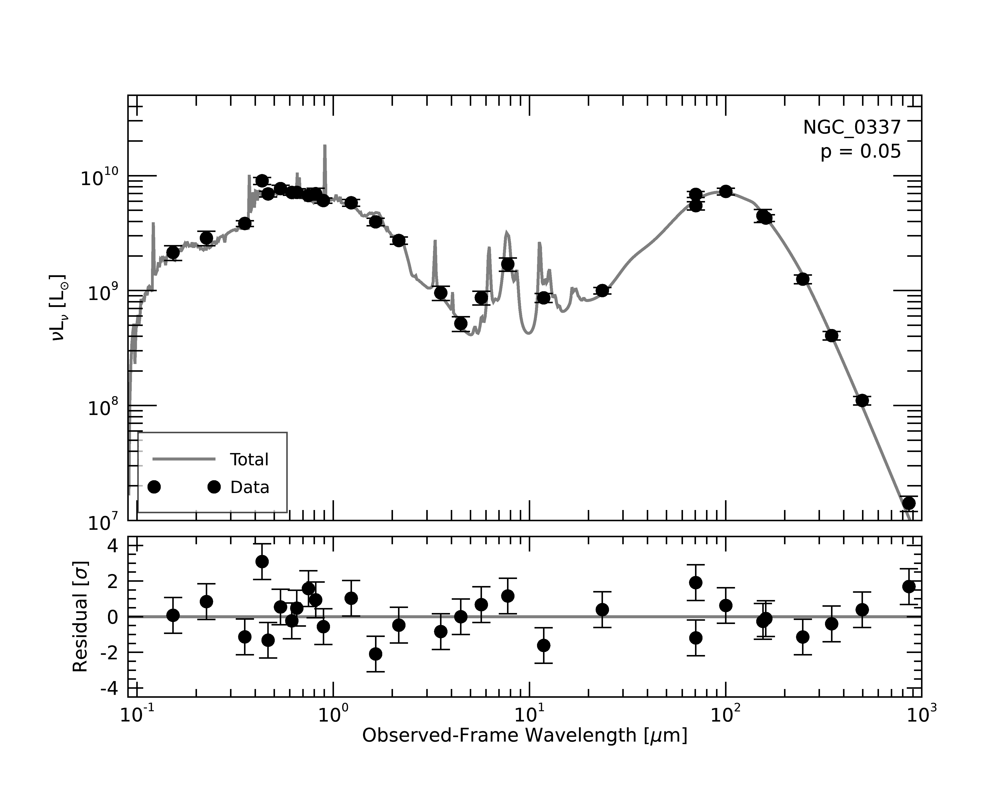
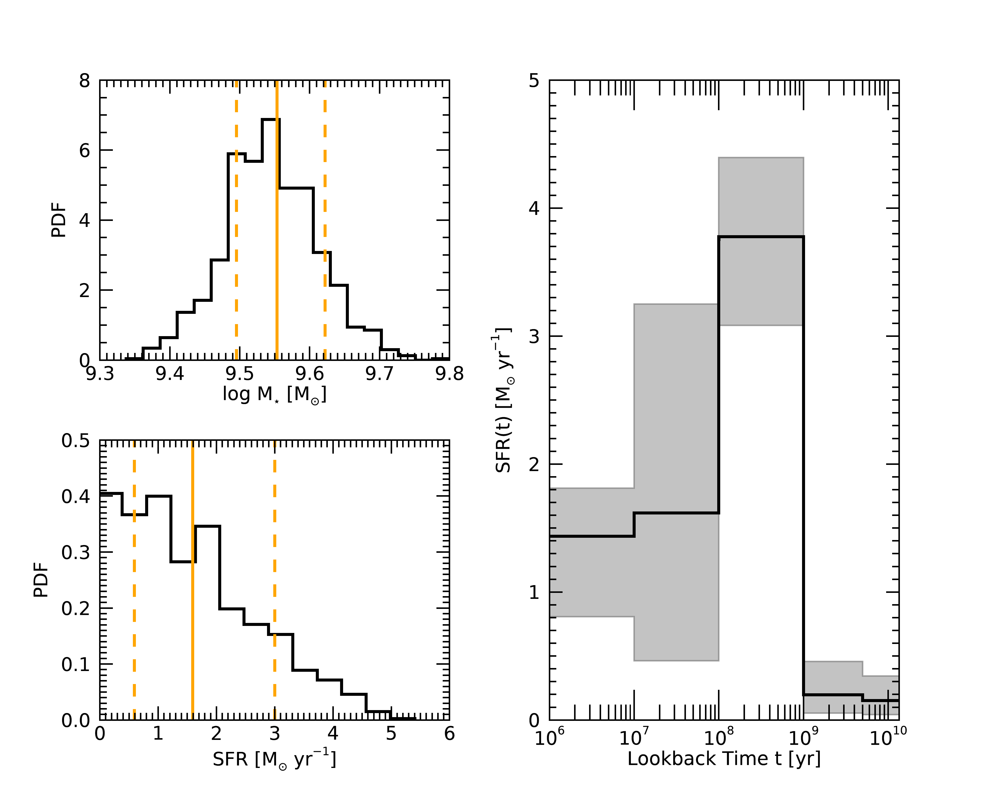
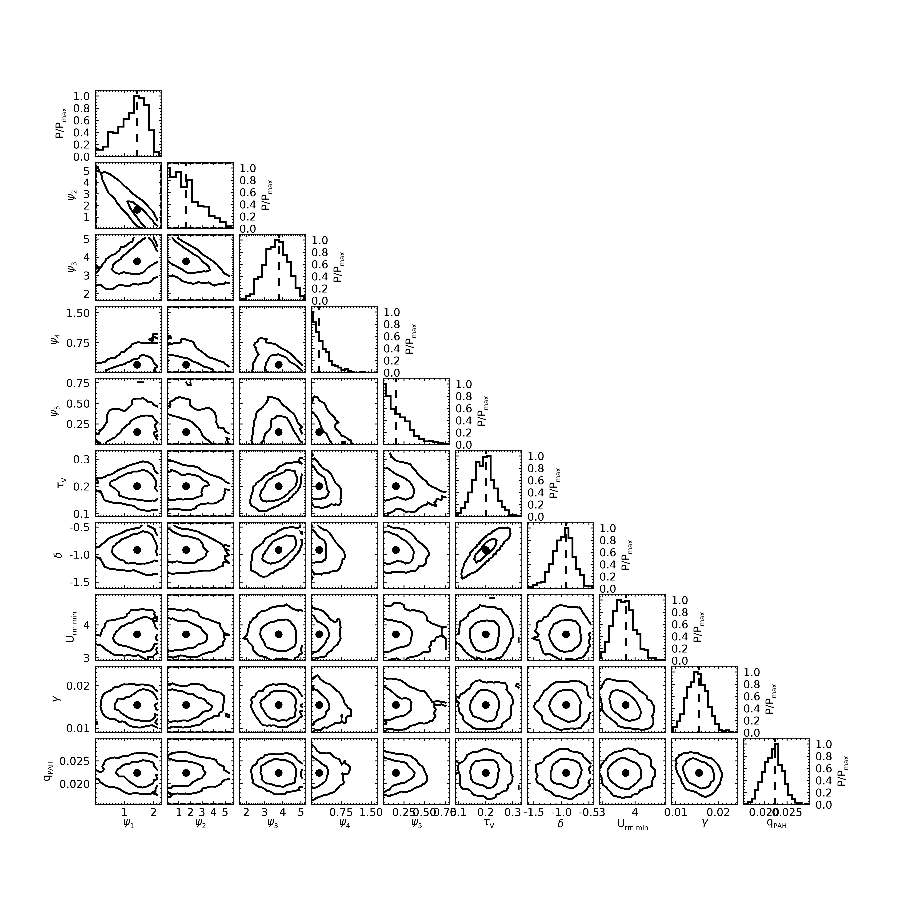

Basic Properties and Star Formation History for NGC 337
=======================================================

The following example is intended to give an idea of the typical
use-case of Lightning for a "normal" galaxy. We use a relatively
simple, general model to fit the SED of NGC 337.

Data
^^^^

We utilize the UV-to-submm photometry for NGC 337 from Table 2 in `Dale et al. (2017)`_,
correcting it for Galactic extinction using the :math:`E(B-V)` and :math:`A_\lambda / A_V`
given in their Tables 1 and 2.

The relevant data file can be found in ``examples/basic_NGC_337/`` as ``ngc337_dale17_photometry.fits``.

Configuration
^^^^^^^^^^^^^

Since this example is intended to be basic and general, we'll stick close to the default
configuration.

We'll set the output filename:

.. literalinclude:: ../../../examples/basic_NGC_337/lightning_configure.pro
    :language: idl
    :dedent:
    :lineno-match:
    :lines: 71
    :emphasize-lines: 1

and increase the model uncertainty to :math:`5\%`:

.. literalinclude:: ../../../examples/basic_NGC_337/lightning_configure.pro
    :language: idl
    :dedent:
    :lineno-match:
    :lines: 91
    :emphasize-lines: 1

Since we have quite a lot of high-quality data, we'll use the modified Calzetti
:ref:`dust-attenuation-model` curve for more flexibility:

.. literalinclude:: ../../../examples/basic_NGC_337/lightning_configure.pro
    :language: idl
    :dedent:
    :lineno-match:
    :lines: 211
    :emphasize-lines: 1

but we'll leave its priors and parameters at their default settings.

Everything else we want is already enabled by default: the restricted Draine and Li (2007)
:ref:`dust-emission-model`, the :ref:`affine-mcmc-label` sampler, and the automatic
:ref:`postprocessing-label` of the MCMC chains.

Running Lightning
^^^^^^^^^^^^^^^^^

.. note::

	The IDL code snippets below are also available in batch file format, as ``examples/basic_NGC_337/NGC337_batch.pro``.

To run Lightning, we now need only open an IDL session and do

.. literalinclude:: ../../../examples/basic_NGC_337/NGC337_batch.pro
    :language: idl
    :dedent:
    :lines: 2-5

Analysis
^^^^^^^^

We first load the results and check that the MCMC sampler converged and reached a statistically acceptable fit:

.. literalinclude:: ../../../examples/basic_NGC_337/NGC337_batch.pro
    :language: idl
    :dedent:
    :lines: 11-17

.. code-block:: text

    //Convergence for NGC 337//
    Mean acceptance fraction: 0.33788267
    Convergence flag: 0
    Short chain flag: 0
    Number of "stranded" walkers: 1.00000
    PPC p-value: 0.049500000

We can see that the acceptance fraction is good (more than :math:`20\%` , less than :math:`50\%` ) and that Lightning
is confident that the MCMC sampler converged to a solution. We have the requested 1000 samples of our posterior
distributions, and only 1 walker was "stranded." The p-value is low but not extremely low, so we'll inspect the
best fit to see how it looks. The function ``NGC337_sed_plot.pro`` has been provided to help us do this:

.. literalinclude:: ../../../examples/basic_NGC_337/NGC337_batch.pro
    :language: idl
    :dedent:
    :lines: 21

The plot looks like so:

We can see from the SED plot and the residuals that the fit is actually quite good: it represents the data pretty well,
and any under-fitting leading to the low p-value seems to be coming from one or two bands.

Now, one of the typical goals of SED fitting is constraint of the stellar mass and star formation rate. We'll calculate
these quantities (the stellar mass is actually already calculated in post-processing) and their posterior percentiles:

.. literalinclude:: ../../../examples/basic_NGC_337/NGC337_batch.pro
    :language: idl
    :dedent:
    :lines: 27-29

where we're looking specifically at the star formation rate average over the last 100 Myr (i.e., the first two steps
of our SFH). Then we can print them out

.. literalinclude:: ../../../examples/basic_NGC_337/NGC337_batch.pro
    :language: idl
    :dedent:
    :lines: 31-40

and see

.. code-block:: text

    //Basic properties for NGC 337//
    log(Mstar / Msun) =  9.55 (+ 0.07) (- 0.06)
    SFR / [Msun yr-1] =  1.59 (+ 1.41) (- 1.00)

where the upper and lower uncertainties (from the 16th and 84th percentiles of the posterior) are given in parentheses.
We can visualize the posteriors on these two quantities and the SFH with the ``NGC337_mstar_sfr_sfh.pro`` function:

.. literalinclude:: ../../../examples/basic_NGC_337/NGC337_batch.pro
    :language: idl
    :dedent:
    :lines: 42

which produces the following graphic:

In this visualization, it's easier to see that the SFR over the last 100 Myr is consistent with 0 -- there is relatively little
recent star formation. The SFH plot backs this up: while the overall shape of the SFH is uncertain (as we typically expect from
SED fitting), it's consistent with a declining burst of star formation between 100 Myr and 1 Gyr ago.

Of course, these are not the only properties of interest. Even the simple model in this example has a 10-dimensional
parameter space, which gives us information mainly about the dust in the galaxy. For the final part of this example
we'll make the traditional corner plot of the posterior distribution to see the constraints on the
model parameters.

.. literalinclude:: ../../../examples/basic_NGC_337/NGC337_batch.pro
    :language: idl
    :dedent:
    :lines: 50-80

This produces the following corner plot:

We can see that the galaxy is relatively unobscured (:math:`\tau_V < 0.3` ), and that the dust attenuation and
emission parameters are in line with expectations from local galaxies, with :math:`U_{\rm min} < 5` and
:math:`\gamma \approx 0.01` , as in e.g. `Dale et al. (2017)`_.

.. References
.. _Dale et al. (2017): https://ui.adsabs.harvard.edu/abs/2017ApJ...837...90D/abstract
