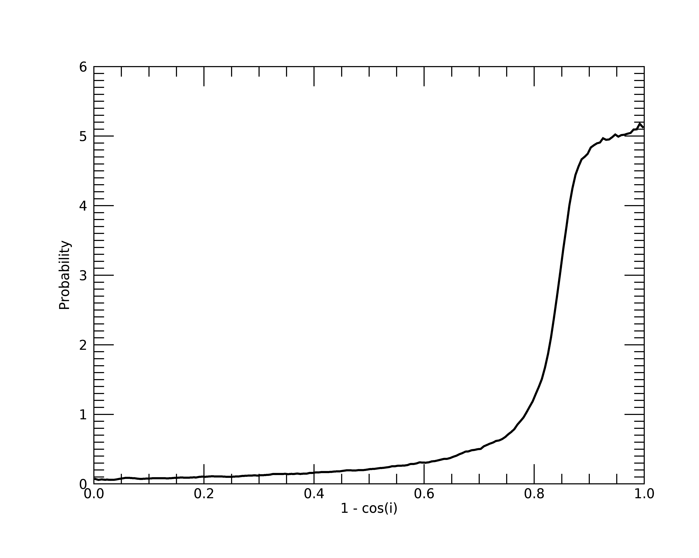
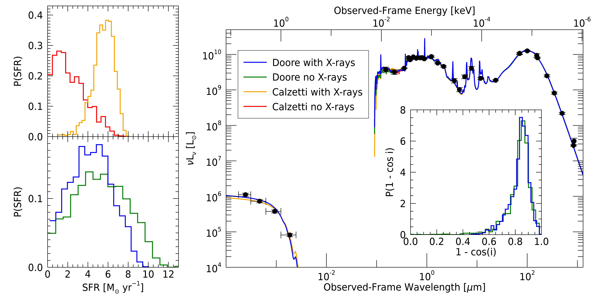

Stellar X-ray Emission in the Edge-on Galaxy NGC 4631
=====================================================

The following example shows how how X-rays emitted from the stellar
binary population along with inclination-dependent attenuation
can be used to help constrain the SFR of the edge-on galaxy, NGC 4631.
 

Data
^^^^

For this example we will include 4 bands of X-ray photometry (0.5--1, 1--2, 2--4, and 4--7 keV) when
fitting with an X-ray model. This photometry was generated from the Chandra ACIS-I data (ObsID 797)
using the procedures detailed in Section~3.2 of `Lehmer et al. (2019)
<https://ui.adsabs.harvard.edu/abs/2019ApJS..243....3L/abstract>`_. This method did not generate
uncertainties on the X-ray fluxes. Therefore, we assume a base 10\% uncertainty for each band. 
Additionally, we assume a Galactic HI column density of :math:`N_H = 1.29 \times 10^{20}\ {\rm cm}^{-2}`.

For the UV-to-submm photometry, we utilize the data for NGC 4631 from Table 2 of `Dale et al. (2017)
<https://ui.adsabs.harvard.edu/abs/2017ApJ...837...90D/abstract>`_, which we correct
for Galactic extinction using their listed values in Tables 1 and 2.

The relevant data files, with and without X-ray data, can be found in ``examples/inclined_NGC_4631/`` as
``ngc4631_dale17+xrays_photometry.fits`` and ``ngc4631_dale17_photometry.fits``, respectively.

Configuration
^^^^^^^^^^^^^

To show the effects of including X-rays and inclination-dependence in this example, we want to model
the SED four different ways, using the permutations of including and excluding stellar
:ref:`xray-emission-model` with the base Calzetti and Doore+21 :ref:`dust-attenuation-model` curves. 
To model the SED four ways, we first change the below lines of the configuration files in 
``examples/inclined_NGC_4631/Calz+Xrays/``, ``examples/inclined_NGC_4631/Calz/``, ``examples/inclined_NGC_4631/Doore+Xrays/``,
and ``examples/inclined_NGC_4631/Doore/`` from the defaults to the configuration settings in common
between the the four models.

Common Settings
"""""""""""""""

We add 5% model uncertainty

.. literalinclude:: ../../../examples/inclined_NGC_4631/Calz+Xrays/lightning_configure.pro
    :language: idl
    :dedent:
    :lineno-match:
    :lines: 91
    :emphasize-lines: 1

As for the dust emission model, we limit initialization of :math:`U_{\rm min}` and :math:`\gamma` to
lower values than the default, since nearby galaxies like NGC 4631 typically have :math:`U_{\rm min} < 5`
and :math:`\gamma \approx 0.01` (`Dale et al. 2017 <https://ui.adsabs.harvard.edu/abs/2017ApJ...837...90D/abstract>`_).

.. literalinclude:: ../../../examples/inclined_NGC_4631/Calz+Xrays/lightning_configure.pro
    :language: idl
    :dedent:
    :lineno-match:
    :lines: 341-344
    :emphasize-lines: 3

.. literalinclude:: ../../../examples/inclined_NGC_4631/Calz+Xrays/lightning_configure.pro
    :language: idl
    :dedent:
    :lineno-match:
    :lines: 374-377
    :emphasize-lines: 3

For the post-processing setting of the MCMC algorithm, we increase the number of final elements to 2000:

.. literalinclude:: ../../../examples/inclined_NGC_4631/Calz+Xrays/lightning_configure.pro
    :language: idl
    :dedent:
    :lineno-match:
    :lines: 643
    :emphasize-lines: 1

Calzetti Attenuation
""""""""""""""""""""

For the two models using the Calzetti attenuation, we will adjust the initializations on 
:math:`\tau_V` to smaller values, since the average attenuation should generally be low.

.. literalinclude:: ../../../examples/inclined_NGC_4631/Calz+Xrays/lightning_configure.pro
    :language: idl
    :dedent:
    :lineno-match:
    :lines: 220-223
    :emphasize-lines: 3

We will also decrease the number of MCMC trials required to :math:`10^4`, since the base Calzetti models
(even with stellar X-ray emission) tend to converge quickly.

.. literalinclude:: ../../../examples/inclined_NGC_4631/Calz+Xrays/lightning_configure.pro
    :language: idl
    :dedent:
    :lineno-match:
    :lines: 539
    :emphasize-lines: 1

Doore+21 Attenuation
""""""""""""""""""""

For the two models using the inclination-dependent Doore+21 attenuation, we will first set them to
use this attenuation curve.

.. literalinclude:: ../../../examples/inclined_NGC_4631/Doore+Xrays/lightning_configure.pro
    :language: idl
    :dedent:
    :lineno-match:
    :lines: 211
    :emphasize-lines: 1

Next, we will adjust the initialization range for :math:`\tau_B^f` to lower values, since, like the
Calzetti attenuation, we expect lower attenuation.

.. literalinclude:: ../../../examples/inclined_NGC_4631/Doore+Xrays/lightning_configure.pro
    :language: idl
    :dedent:
    :lineno-match:
    :lines: 269-272
    :emphasize-lines: 3

Most importantly, we will then set :math:`\cos i` to have a tabulated prior using the Monte Carlo (MC)
method described in Section 3 of `Doore et al. 2021 <https://ui.adsabs.harvard.edu/abs/2021ApJ...923...26D/abstract>`_.
This prior will be placed in the ``examples/inclined_NGC_4631/`` directory of Lightning. So, we will set the path to the 
absolute path using the ``!lightning_dir`` system variable created when you first built Lightning.

.. literalinclude:: ../../../examples/inclined_NGC_4631/Doore+Xrays/lightning_configure.pro
    :language: idl
    :dedent:
    :lineno-match:
    :lines: 289-292
    :emphasize-lines: 1-3

To generate this prior, we have created a function (``inclination_pdf.pro``) that performs the MC simulation
with the inputs of the axis ratio and its uncertainty. The function also normalizes the distribution to have
a total area of 1 as required by Lightning. For the axis ratio, we use the B-band ellipse values from the 
`HyperLeda database <http://leda.univ-lyon1.fr/>`_, since they have associated uncertainties. The prior 
generation can then be done with:

.. literalinclude:: ../../../examples/inclined_NGC_4631/ngc4631_batch.pro
    :language: idl
    :dedent:
    :lines: 2-20

Additionally, let's plot this prior to make sure we are getting a distribution that strongly favors an edge-on view:

.. literalinclude:: ../../../examples/inclined_NGC_4631/ngc4631_batch.pro
    :language: idl
    :dedent:
    :lines: 25-29

Great, as we can see, the probability distribution is skewed to values with :math:`1 - \cos i > 0.8`, 
which corresponds to :math:`i > 78^\circ`. Therefore, this distribution highly favors the edge-on views as 
we want.

Going back to the configuration, we will fix the bulge-to-disk ratio of the Doore+21 attenuation
to 0, since we are assuming NGC 4631 is disk dominated.

.. literalinclude:: ../../../examples/inclined_NGC_4631/Doore+Xrays/lightning_configure.pro
    :language: idl
    :dedent:
    :lineno-match:
    :lines: 299-302
    :emphasize-lines: 1-2

We will then increase the number of MCMC trials required to :math:`5 \times 10^4`, since the Doore+21 models
can take a while to properly converge.

.. literalinclude:: ../../../examples/inclined_NGC_4631/Doore+Xrays/lightning_configure.pro
    :language: idl
    :dedent:
    :lineno-match:
    :lines: 539
    :emphasize-lines: 1

X-ray Fit
"""""""""

For the two models using X-ray emission, we additionally modify the following settings. First, 
we turn on the X-ray emission module:

.. literalinclude:: ../../../examples/inclined_NGC_4631/Calz+Xrays/lightning_configure.pro
    :language: idl
    :dedent:
    :lineno-match:
    :lines: 415
    :emphasize-lines: 1

We then set Lightning to expect our X-ray data in fluxes and make sure to turn off the X-ray AGN model:

.. literalinclude:: ../../../examples/inclined_NGC_4631/Calz+Xrays/lightning_configure.pro
    :language: idl
    :dedent:
    :lineno-match:
    :lines: 422
    :emphasize-lines: 1

.. literalinclude:: ../../../examples/inclined_NGC_4631/Calz+Xrays/lightning_configure.pro
    :language: idl
    :dedent:
    :lineno-match:
    :lines: 450
    :emphasize-lines: 1

Individual Fits
"""""""""""""""

Finally, for each of the configurations, we need to update their output file names. For the Calzetti
fit with X-rays (``examples/inclined_NGC_4631/Calz+Xrays/lightning_configure.pro``), we will name the output:

.. literalinclude:: ../../../examples/inclined_NGC_4631/Calz+Xrays/lightning_configure.pro
    :language: idl
    :dedent:
    :lineno-match:
    :lines: 71
    :emphasize-lines: 1

For the Calzetti without X-rays (``examples/inclined_NGC_4631/Calz/lightning_configure.pro``):

.. literalinclude:: ../../../examples/inclined_NGC_4631/Calz/lightning_configure.pro
    :language: idl
    :dedent:
    :lineno-match:
    :lines: 71
    :emphasize-lines: 1

For the Doore+21 with X-rays (``examples/inclined_NGC_4631/Doore+Xrays/lightning_configure.pro``):

.. literalinclude:: ../../../examples/inclined_NGC_4631/Doore+Xrays/lightning_configure.pro
    :language: idl
    :dedent:
    :lineno-match:
    :lines: 71
    :emphasize-lines: 1

And for the Doore+21 without X-rays (``examples/inclined_NGC_4631/Doore/lightning_configure.pro``):

.. literalinclude:: ../../../examples/inclined_NGC_4631/Doore/lightning_configure.pro
    :language: idl
    :dedent:
    :lineno-match:
    :lines: 71
    :emphasize-lines: 1

Running Lightning
^^^^^^^^^^^^^^^^^

.. note::

    The IDL code snippets below (and the inclination prior ones above) are also available
    in batch file format, as ``examples/inclined_NGC_4631/ngc4631_batch.pro``.

Now that we have set up the configurations, we are ready to run Lightning for each of the
models. Before, we do that we need to quickly copy the input data into each fitting
directory (e.g., ``examples/inclined_NGC_4631/Calz+Xrays/``).

.. literalinclude:: ../../../examples/inclined_NGC_4631/ngc4631_batch.pro
    :language: idl
    :dedent:
    :lines: 34-38

Additionally, we have pre-compiled the needed :math:`L_{\rm bol}^{\rm abs}` table for the
Doore+21 model to save time during fitting, as generating this table can take a while on machines
with < 10GB of RAM. So, we need to copy it into the Doore+21 fitting directories.

.. literalinclude:: ../../../examples/inclined_NGC_4631/ngc4631_batch.pro
    :language: idl
    :dedent:
    :lines: 43-46

Now, we can fit all of the models to the SED with:

.. literalinclude:: ../../../examples/inclined_NGC_4631/ngc4631_batch.pro
    :language: idl
    :dedent:
    :lines: 51-56

With the MCMC configuration we’ve selected for the Calzetti fits, this may take around 20--25 minutes each
on a simple laptop CPU (we ran it on a ca. 2016 1.2 GHz Intel Core m5). For the increased MCMC trials of the
Doore+21 fits, it may take around 1.5--2 hours each. We note that you can run these fits simultaneously
in separate IDL sessions. 

Analysis
^^^^^^^^

Once the fits finish, Lightning will automatically create post-processed files for us containing the results.

.. literalinclude:: ../../../examples/inclined_NGC_4631/ngc4631_batch.pro
    :language: idl
    :dedent:
    :lines: 61-65

Convergence
"""""""""""

As always, we need to first check each of our fits for convergence. 

.. literalinclude:: ../../../examples/inclined_NGC_4631/ngc4631_batch.pro
    :language: idl
    :dedent:
    :lines: 70-94

.. code-block:: text

    //Convergence Checks//
    //Convergence for the Calzetti (no X-rays) fit//
    Mean acceptance fraction: 0.36408533
    Convergence flag: 0
    Short chain flag: 0
    
    //Convergence for the Calzetti with X-rays fit//
    Mean acceptance fraction: 0.35554533
    Convergence flag: 0
    Short chain flag: 0
    
    //Convergence for the Doore+21 (no X-rays) fit//
    Mean acceptance fraction: 0.28195600
    Convergence flag: 1
    Short chain flag: 0
    
    //Convergence for the Doore+21 with X-rays  fit//
    Mean acceptance fraction: 0.28607467
    Convergence flag: 0
    Short chain flag: 0

Great, as we can see, all fits had enough independent trials to create the 2000 samples we
wanted (``short_chain_flag = 0``). Also, all of the fits converged except the one for the
Doore+21 attenuation without X-rays. Let's separate out its autocorrelation time metric and
acceptance fraction metrics to see which is indicating potentially failed convergence.

.. literalinclude:: ../../../examples/inclined_NGC_4631/ngc4631_batch.pro
    :language: idl
    :dedent:
    :lines: 99-101

.. code-block:: text

    //Detailed Convergence Checks//
    Number of parameters with high autocorrelation times: 1.00000
    Number of walkers with low acceptance fractions: 0.00000

Okay, so the acceptance fractions are good, and only one parameter has a high autocorrelation
time. Let's check what parameter this is and how it compares to our factor of 50 threshold for
considering convergence (i.e., ``NTRIALS/AUTOCORR_TIME`` should be ~50). 

.. literalinclude:: ../../../examples/inclined_NGC_4631/ngc4631_batch.pro
    :language: idl
    :dedent:
    :lines: 106-110

.. code-block:: text

    //Autocorrelation Time Checks//
    Parameter with high autocorrelation time:  COSI
    Ratio of Ntrials to autocorr_time:  48.923960

This is good to see. The "problem" parameter is the inclination, which we expected either it
or :math:`\tau_B^f` to be. Additionally, we can see that it is just barely below our default 
threshold of 50. Since we want a value of ~50, this is close enough, and we can be confident
that our autocorrelation time for the inclination is accurate. Therefore, our solution has converged.

Figure
""""""

Now that we have confirmed convergence, we will make a figure to see how the SFRs from the fits compare.
To do this, we will plot the posterior of each SFR of the last 100 My and the best-fit spectra to the 
SED. We have prepared a function for this: ``ngc4631_plots.pro``.

.. literalinclude:: ../../../examples/inclined_NGC_4631/ngc4631_batch.pro
    :language: idl
    :dedent:
    :lines: 115-119

From the plot, each of the four models' SFRs can be seen to have general agreement, with the Calzetti models having
stronger variation when including the X-rays compared to the Doore+21 models. Since the Calzetti
attenuation model assumes a uniform spherical distribution of stars and dust, it is too simplistic for edge-on
galaxies. Therefore, by including the inclination dependences of the Doore+21 models, we can get a more accurate
estimate of the SFR, with the inclusion of the X-rays increasing the precision as we would expect.
Further, the X-ray data rules out some higher SFR solutions in both cases (i.e.,
:math:`{\rm SFR} > 8\ M_\odot\ {\rm yr}^{-1}`), as they become more unlikely with the X-ray data constraint.

