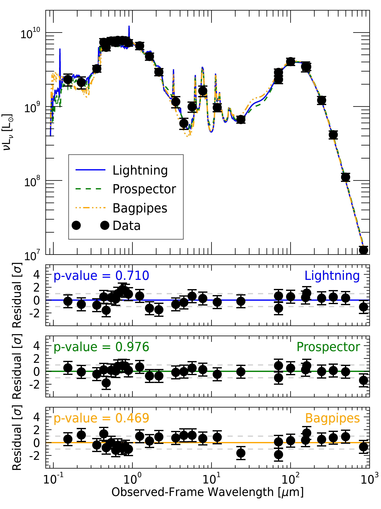
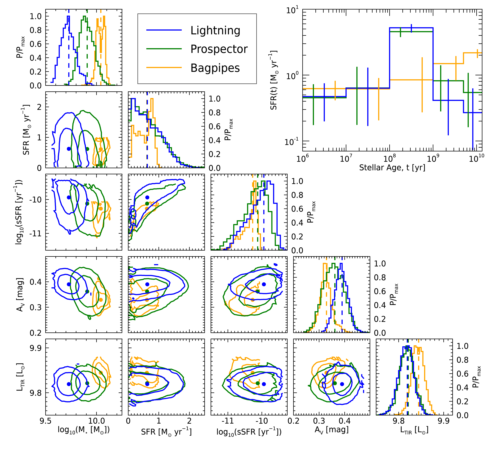

SED Fitting Code Comparison with NGC 628
========================================

The following example shows how Lightning compares with other Bayesian
sampling SED fitting codes. Specifically, we compare with `Prospector
<https://github.com/bd-j/prospector>`_ and `BAGPIPES
<https://github.com/ACCarnall/bagpipes>`_ by fitting the UV-to-submm
photometry of the nearby face-on spiral galaxy NGC 628.
 

Data
^^^^

For the UV-to-submm photometry, we utilize the data for NGC 628 from Table 2 of `Dale et al. (2017)
<https://ui.adsabs.harvard.edu/abs/2017ApJ...837...90D/abstract>`_, which we correct
for Galactic extinction using their listed values in Tables 1 and 2. Additionally, we add 
in quadrature an additional 10% uncertainty to the quoted uncertainties in `Dale et al. (2017)
<https://ui.adsabs.harvard.edu/abs/2017ApJ...837...90D/abstract>`_ to act as model uncertainties in our fits.

The relevant data file can be found in ``examples/comparison_NGC_628/`` as ``ngc628_dale17_photometry.fits``.

Configuration
^^^^^^^^^^^^^

For this fit, we use close to the default configuration settings. First, we change the
output filename to:

.. literalinclude:: ../../../examples/comparison_NGC_628/lightning_configure.pro
    :language: idl
    :dedent:
    :lineno-match:
    :lines: 71
    :emphasize-lines: 1

Then, we set the max CPUs to 2, to suppress the progress printing for each MCMC trial.

.. literalinclude:: ../../../examples/comparison_NGC_628/lightning_configure.pro
    :language: idl
    :dedent:
    :lineno-match:
    :lines: 81
    :emphasize-lines: 1

We update the oldest SFH age bins to have a maximum age of 13.4 Gyr. This update was made, because
BAGPIPES required a maximum age of 13.4 Gyr.

.. literalinclude:: ../../../examples/comparison_NGC_628/lightning_configure.pro
    :language: idl
    :dedent:
    :lineno-match:
    :lines: 162
    :emphasize-lines: 1

We decrease the number of MCMC trials per walker to :math:`10^4`:

.. literalinclude:: ../../../examples/comparison_NGC_628/lightning_configure.pro
    :language: idl
    :dedent:
    :lineno-match:
    :lines: 539
    :emphasize-lines: 1

and increase the number of final elements in the post-processed chain to 2000:

.. literalinclude:: ../../../examples/comparison_NGC_628/lightning_configure.pro
    :language: idl
    :dedent:
    :lineno-match:
    :lines: 643
    :emphasize-lines: 1

Finally, we will keep 100% of the high resolution models, as we need them to compute
:math:`L_{\rm TIR}` using the total model from 8--1000 :math:`\mu{\rm m}`.

.. literalinclude:: ../../../examples/comparison_NGC_628/lightning_configure.pro
    :language: idl
    :dedent:
    :lineno-match:
    :lines: 654
    :emphasize-lines: 1

Running Lightning
^^^^^^^^^^^^^^^^^

.. note::

    The IDL code snippets below are also available in batch file format, as
    ``examples/comparison_NGC_628/ngc628_batch.pro``.

Now that we have set up the configuration, we are ready to run Lightning.

.. literalinclude:: ../../../examples/comparison_NGC_628/ngc628_batch.pro
    :language: idl
    :dedent:
    :lines: 2-5

With the MCMC configuration we’ve selected, this may take around 10--20 minutes
on a simple laptop CPU (we ran it on a ca. 2016 1.2 GHz Intel Core m5).

Running Prospector and BAGPIPES
^^^^^^^^^^^^^^^^^^^^^^^^^^^^^^^

We have included the Python scripts required to run our set up of Prospector and
BAGPIPES in ``examples/comparison_NGC_628/`` as ``prospector/prospector_fit.py`` and 
``bagpipes/bagpipes_fit.py``, respectively. Since these codes are
in Python and require their own installations, we also include the saved outputs from
our runs of these scripts as ``prospector/ngc_628_prospector.fits.gz`` and
``bagpipes/ngc_628_bagpipes.fits.gz``, respectively. 

.. note::

    To run these scripts, you will need to install each of the SED fitting codes as
    instructed in their documentation (`Prospector Installation 
    <https://prospect.readthedocs.io/en/latest/installation.html#installation>`_ and
    `BAGPIPES Installation <https://bagpipes.readthedocs.io/en/latest/#source-and-installation>`_)
    We recommend installing each in their own `Conda Environment
    <https://conda.io/projects/conda/en/latest/user-guide/tasks/manage-environments.html#creating-an-environment-with-commands>`_.
    Once the SED fitting codes are installed, you can run them by changing to the
    Lightning examples directory for NGC 628, then calling Python and the script. For example,
    in a new unix shell do (with the appropriate conda environment activated):

    .. code-block:: sh

        cd <path_to_install>/lightning/examples/comparison_NGC_628/prospector/
        python prospector_fit.py
        cd <path_to_install>/lightning/examples/comparison_NGC_628/bagpipes/
        python bagpipes_fit.py

With the configurations we’ve selected for these two codes, Prospector may take around 75--90 minutes,
and BAGPIPES may take around 10--20 minutes both on a simple laptop CPU (we ran them on the same ca.
2016 1.2 GHz Intel Core m5 as the Lightning fit).

Analysis
^^^^^^^^

Once the fits finish, Lightning will automatically create post-processed files for us containing the results.
Additionally, we have set up our Prospector and BAGPIPES scripts to perform some additional post-processing
to match Lightning's output. Let's read and load it and the results from Prospector and BAGPIPES.

.. literalinclude:: ../../../examples/comparison_NGC_628/ngc628_batch.pro
    :language: idl
    :dedent:
    :lines: 10-13

Convergence
"""""""""""

As always, we need to first check each of the fits for convergence. This is only required
for Lightning and Prospector, as the nested sampling algorithm in BAGPIPES converges by design.

.. literalinclude:: ../../../examples/comparison_NGC_628/ngc628_batch.pro
    :language: idl
    :dedent:
    :lines: 18-30

.. code-block:: text

    //Convergence Checks//
    //Convergence for Lightning fit//
    Mean acceptance fraction: 0.33530800
    Convergence flag: 1
    Short chain flag: 0
    
    //Convergence for Prospector fit//
    Mean acceptance fraction: 0.35677733
    Maximum autocorrelation time: 154.16696

Great, both Lightning and Prospector had good acceptance fractions. However, Lightning did
have a flag set for the convergence, which we will investigate in a second. As for Prospector, its
maximum autocorrelation time is ~155. For our chosen number of MCMC trials, we required autocorrelation times
below 200 (1e4/50 = 200). Therefore, Prospector's solution did converge, and we can turn our attention
to further inspecting Lightning's flag. Let's separate out Lightning's autocorrelation time metric and
acceptance fraction metrics to see which is indicating potentially failed convergence.

.. literalinclude:: ../../../examples/comparison_NGC_628/ngc628_batch.pro
    :language: idl
    :dedent:
    :lines: 35-37

.. code-block:: text

    //Detailed Lightning Convergence Checks//
    Number of parameters with high autocorrelation times: 0.00000
    Number of walkers with low acceptance fractions: 1.00000

Okay, so the autocorrelation time is good (maximum below 200), and only one walker has a low acceptance
rate. Let's check to see if it was flagged as stranded. 

.. literalinclude:: ../../../examples/comparison_NGC_628/ngc628_batch.pro
    :language: idl
    :dedent:
    :lines: 42-44

.. code-block:: text

    //Stranded Walkers Lightning fit//
    Number of walkers with low acceptance and not flagged as stranded: 0.00000

Excellent, so this one low acceptance fraction walker was flagged as stranded and removed.
Therefore, we can definitely say the our Lightning solution has converged.

Figures
"""""""

Now that we have confirmed convergence, we will make some figures to see how the results from the
different codes compare. First, we will plot the high resolution model spectra and residuals to
see if all of the codes fit the data well. We have prepared a function for this: ``ngc4631_plots.pro``.

.. literalinclude:: ../../../examples/comparison_NGC_628/ngc628_batch.pro
    :language: idl
    :dedent:
    :lines: 48-52

From the plot, we can see that each of the p-values (which we calculated from a PPC) and residuals for all codes
appropriately model the data (p-value > 0.4). It is interesting to note that the best-fit model
spectra and resulting residuals from the Lightning and Prospector fits are highly similar, while BAGPIPES has a
more comparatively unique spectrum and residuals in the UV-to-NIR. We expected this variation, since the different
IMF used in BAGPIPES can create a variation in the UV-to-NIR stellar emission models.

Finally, let's compare some derived physical properties from each SED fitting code. Specifically, let's look
at the stellar mass, recent SFR of the last 100 Myr, the sSFR of the last 100 Myr, the V-band attenuation, and
:math:`L_{\rm TIR}` (i.e., the bolometric luminosity from 8–1000 μm).

.. literalinclude:: ../../../examples/comparison_NGC_628/ngc628_batch.pro
    :language: idl
    :dedent:
    :lines: 57-58

We can see from the distributions in the lower left that all three codes have derived parameters, except stellar mass, 
that are in excellent agreement. The variation in stellar mass between codes is expected and entirely due to the differences 
in SSPs and IMFs, which dictate the surviving stellar mass of the populations over time. As for the SFHs in the upper right, 
we can see that Lightning and Prospector have near identical results, which is good news given that both codes have 
almost identical models and were independently developed. As for the differences in BAGPIPE's SFH, this again is mainly
due to the difference in IMF, which influences the overall stellar population at given ages.